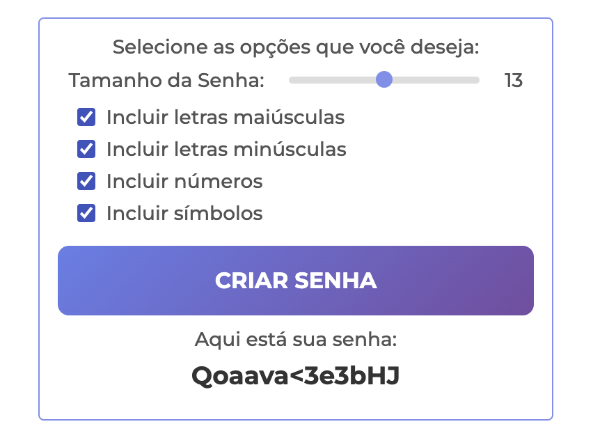

# 🎲 Página de Login com Gerador de Senha

> Página de Login fictícia feita para estudos e aprimoramento das habilidades de Front-End. 

A página contém um formulário para a realização de login e outro para a criação de cadastro, caso não esteja registrado. Além disso, na seção de registro há um Gerador de Senha Aleatória que auxilia o usuário na criação de uma senha, oferecendo opções de escolha para o tamanho total de caracteres, inclusão ou exclusão de caractéres em maiúsculo, minúsculo, númericos e símbolos. 

[Deploy](https://password-generator-beajohnke.vercel.app/).

### 💻 Tecnologias Utilizadas
  

